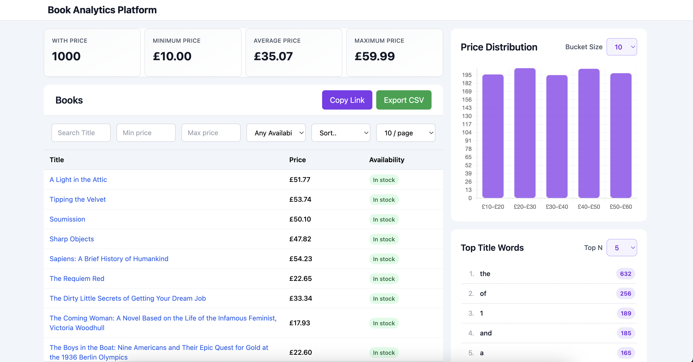

# Book Analytics Pipeline
A full stack web application that scrapes book information, stores it in MongoDB, and provides analytics. Built to practice end-to-end data engineering and full-stack development.

## Screenshot

*Interactive dashboard displaying analytics from 1000+ scraped books with real-time filtering and visualization*

## Tech Stack
- **Backend:** Python, FastAPI, MongoDB, Scrapy
- **Frontend:** React, TypeScript, Tailwind CSS, Chart.js
- **Infrastructure:** Docker

## Setup
```bash
git clone https://github.com/gillpbk16/book-analytics-pipeline.git
cd book-analytics-pipeline

# Start everything with Docker
docker compose up --build

#Access the App 
# Dashboard: http://localhost:3000
# API docs: http://localhost:8000/docs
```

## Features

### API Endpoints:
- `/books` - Search and filter books with pagination
- `/analytics/price-stats` - Price statistics (min/max/average)
- `/analytics/availability` - Availability distribution
- `/analytics/price-buckets` - Price histogram
- `/analytics/title-words` - Most common title words

### Dashboard:
- Browse all scraped books
- View price and availability analytics
- Interactive charts showing data insights

## Key Technologies & Concepts
- Web scraping with Scrapy pipelines and error handling
- API design with FastAPI, including filtering and pagination
- Database operations with MongoDB aggregation pipelines
- Frontend development with React hooks and TypeScript
- Containerization with Docker for consistent deployment


